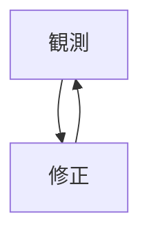

## atcoder

空白で配列を結合したい。

```
data = [9, 9, 8, 0]
print(" ".joint(map(str, data)))
```

トランプのループ
```
suit = "SDCH"
for s in suit:
  print(s)
suit.find(num)
```
listのreverseは return Nonetype, reversedは値を返す。

## 統計
ベイズ

## english
leave O C
の形を間違えやすい。

## kaggle
multi label
```
df.groupby(["country", "variety"]).size().sort_values(ascending=False)
```
数ではなく、値のときは、groupby().poitns.agg[len]などで名前つけてその後、.sort_values(by=["len"])で可能。byのパラメータで複数指定すると、並べる優先度を指定できる。


## dev app
django form

if post分岐で値を受け取る.redirect先も指定可能。

## その他
github でmermaidがサポートされたらしい。
図が書けるので便利。


   
